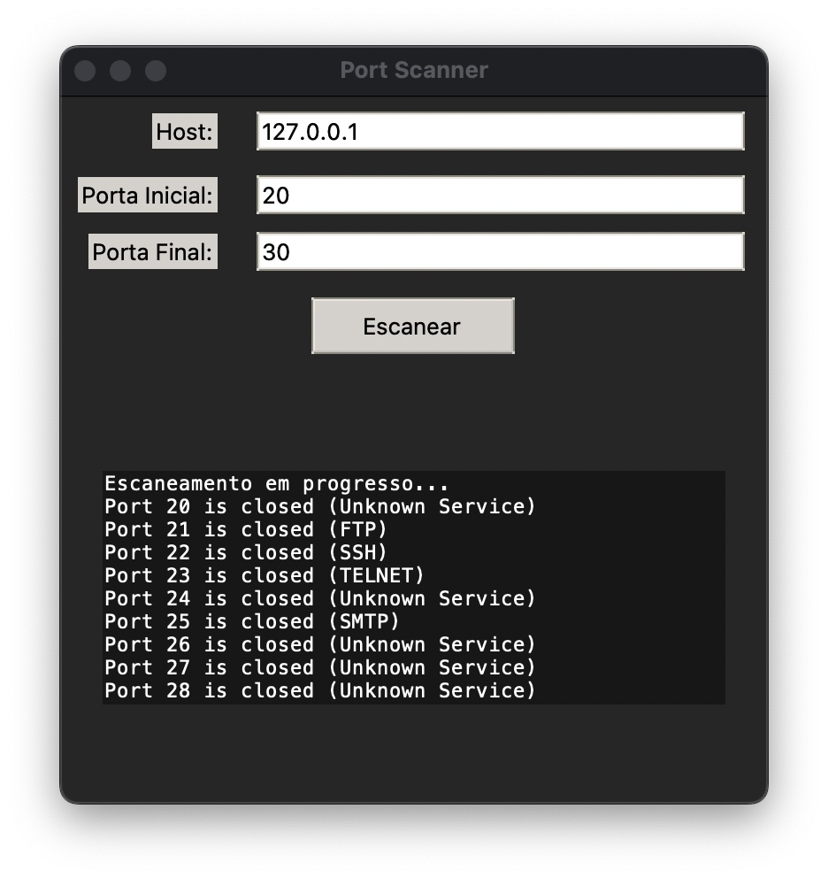

# Cyber-PortScanner


## Desafio 5 (APS) 

Criação de Escaneamento de Portas com Python.

Descrição: Desenvolvimento de uma aplicação que realize o escaneamento de portas de comunicação de um destino por meio de bibliotecas de desenvolvimento da Linguagem de programação Python. 

Você deverá realizar uma pesquisa dos módulos e bibliotecas que permitem o desenvolvimento de uma ferramenta para o escaneamento de portas TCP de acordo com as premissas a seguir: 

•	Ser em linguagem Python;
•	Deverá possuir uma interface amigável e de fácil utilização (user-friendly interface); (1 ponto)
•	Permitir o escaneamento de um host ou uma rede; (1 ponto) 
•	Permitir inserir o range (intervalo) de portas a serem escaneadas; (1 ponto) 
•	Além da função de escaneamento, espera-se que seu código relacione as portas Well-Know Ports e seus serviços, e apresente em sua saída (imprimir) o número da porta e o nome do serviço associado. (2 pontos) 
•	Existem diversos projetos e documentações relacionados com esta atividade. Aproveite para analisar os códigos já desenvolvidos para teu projeto. 


## Requisitos

- Python 3.8 ou superior


## Como usar

1. Clone o repositório
    ```bash
    git clone
    ```

2. Entre na pasta do projeto
    ```bash
    cd Cyber-PortScanner
    ```

3. Criar um ambiente virtual
- Windows
    ```bash
    python -m venv env
    env\Scripts\activate
    ```
- Mac
    ```bash
    python3 -m venv env
    source env/bin/activate
    ```

4. Instale as dependências
    ```bash
    pip install -r requirements.txt
    ```

5. Execute o projeto
    ```bash
    python main.py
    ```

## Exemplo:

<!-- imagem -->


## Como melhorar

Para que o projeto fique ainda melhor, você pode adicionar mais rotas dentro de `ports.txt`. Assim, o programa irá reconhecer mais portas e serviços.